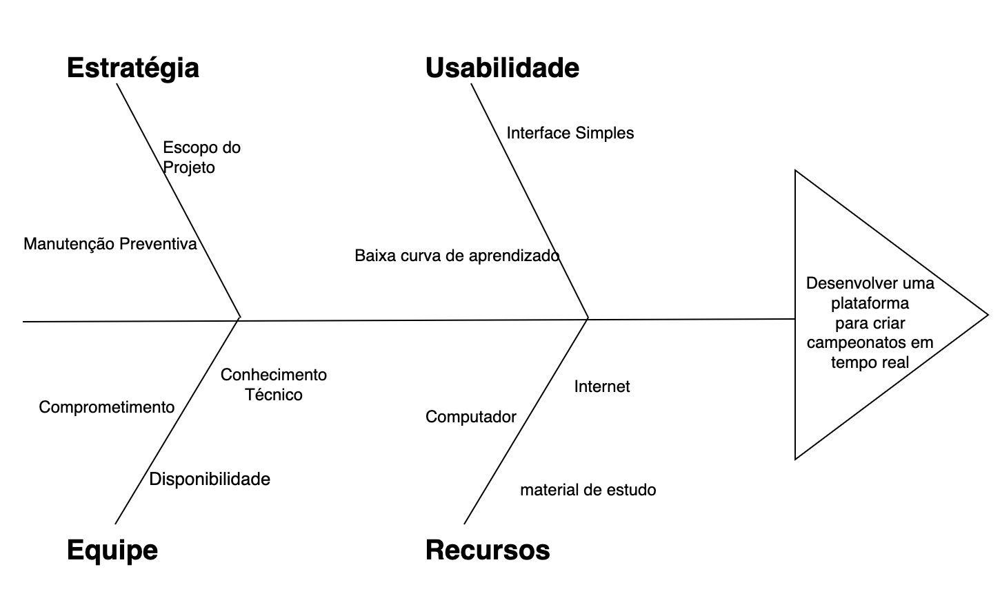

# Método Diagrama Causa-efeito (ishikawa)

## Introdução
O Diagrama de Causa-Efeito, também conhecido como Diagrama de Ishikawa ou Diagrama de Espinha de Peixe, é uma ferramenta de análise usada para identificar e organizar as possíveis causas de um problema específico.

Desenvolvido por Kaoru Ishikawa, ele auxilia equipes na visualização dos fatores que contribuem para um problema, facilitando a identificação de causas raiz ao agrupar fatores relacionados, promovendo uma análise sistemática e colaborativa, que ajuda na tomada de decisões para a resolução eficaz do problema.

Considerado uma das sete ferramentas básicas de qualidade, o diagrama pode ser usado para estruturar uma sessão de brainstorming que permite identificar possíveis causas para um problema, classificando as ideias em categorias úteis.

## Dificuldade em achar uma plataforma para criar campeonatos em tempo real:

## Mercado:

&emsp;&emsp;Refere-se à demanda e interesse do público ou dos consumidores pela plataforma. Um mercado com pouco interesse ou demanda restrita pode dificultar a viabilidade econômica do desenvolvimento da plataforma.

**Pouco interesse**: Existe uma falta de interesse geral no mercado para plataformas que criam campeonatos em tempo real, o que reduz a demanda e o investimento nesse tipo de tecnologia.

**Demanda restrita**: A procura por essas plataformas é limitada, talvez por serem nichos específicos ou pela falta de conscientização sobre os benefícios dessas soluções.

## Funcionalidade:

&emsp;&emsp;Envolve os recursos e capacidades específicas que a plataforma oferece. Para ser eficaz, a plataforma deve incluir uma variedade de funcionalidades que atendam às necessidades dos usuários, como a capacidade de criar e gerenciar campeonatos em tempo real.

**Recursos variados/específicos**: A plataforma precisa oferecer uma variedade de recursos e funcionalidades específicas para atender às diversas necessidades dos usuários.

## Tecnologia:

&emsp;&emsp;Refere-se aos aspectos técnicos envolvidos na criação e manutenção da plataforma. Isso inclui a complexidade técnica do desenvolvimento, bem como o nível de interesse e expertise técnica disponível para lidar com esses desafios.
 

**Complexidade técnica**: O desenvolvimento de uma plataforma para criar campeonatos em tempo real envolve desafios técnicos significativos, que podem dificultar a implementação e manutenção.

**Interesse técnico**: Pode haver uma falta de interesse ou conhecimento técnico entre os desenvolvedores para criar e manter essas plataformas, exacerbando os desafios tecnológicos.

## Usabilidade:

&emsp;&emsp;Diz respeito à facilidade de uso da plataforma. Uma interface intuitiva e uma curva de aprendizado suave são essenciais para garantir que os usuários possam utilizar a plataforma de maneira eficaz e sem frustrações.

**Interface complicada**: Se a interface da plataforma for difícil de usar, isso pode desmotivar os usuários e reduzir a adoção da plataforma.
  
**Curva de aprendizado**: Uma curva de aprendizado íngreme pode impedir que novos usuários se sintam confortáveis utilizando a plataforma rapidamente, afetando a experiência do usuário.

## Manutenção:

&emsp;&emsp;Refere-se às necessidades contínuas de manutenção e atualização da plataforma. Isso inclui a correção de bugs, a implementação de melhorias e a garantia de que a plataforma permaneça segura e funcional ao longo do tempo. O custo e o esforço necessários para a manutenção podem ser significativos.

**Manutenção constante**: A plataforma pode requerer manutenção contínua para permanecer funcional e segura, o que pode ser um desafio para os desenvolvedores.

**Custo de desenvolvimento**: O custo associado ao desenvolvimento e manutenção de uma plataforma robusta pode ser alto, tornando difícil para as empresas justificarem o investimento.

## Incentivos:

&emsp;&emsp;Envolve os fatores financeiros e motivacionais que incentivam o desenvolvimento e a utilização da plataforma. A falta de investimentos ou incentivos pode dificultar a criação e a sustentabilidade da plataforma, limitando seu crescimento e evolução.

**Falta de investimento**: A ausência de incentivos financeiros ou investimentos pode dificultar a criação e o crescimento de plataformas para campeonatos em tempo real.

 <figcaption>Figura 1: Diagrama Causa-efeito Dificuldades.</figcaption> 

 Fonte: <a href="https://github.com/OscarDeBrito
" target="_blank">Oscar Brito</a> e <a href="https://github.com/flavioovatsug" target="_blank">Flávio Gustavo</a>, 2024

## Desenvolver uma plataforma para criar campeonatos em tempo real

### Usabilidade:

&emsp;&emsp;A usabilidade determina o quão intuitiva e agradável é a interação dos usuários com o sistema. Para uma plataforma de campeonatos em tempo real, a facilidade de uso impacta diretamente o sucesso do site, uma vez que organizadores e participantes dependem de atualizações e navegação rápida durante eventos.

**Interface Simples**: A plataforma deve ser projetada com uma interface limpa e bem organizada. Elementos visuais e funções precisam estar dispostos de forma lógica, permitindo que qualquer usuário, independente de experiência prévia, consiga acessar as informações e realizar ações rapidamente.

**Baixa Curva de Aprendizado**: A plataforma deve ser projetada com uma interface limpa e bem organizada. Elementos visuais e funções precisam estar dispostos de forma lógica, permitindo que qualquer usuário, independente de experiência prévia, consiga acessar as informações e realizar ações rapidamente.

### Estratégia:

&emsp;&emsp;A estratégia se refere ao planejamento e às diretrizes que orientam o desenvolvimento e a manutenção da plataforma. Uma estratégia bem definida permite que o projeto seja executado de forma organizada, com objetivos claros e práticas sustentáveis, assegurando a longevidade e a qualidade da plataforma.

**Escopo do Projeto**: Definir um escopo claro ajuda a focar nas funcionalidades essenciais para os campeonatos em tempo real. Isso evita a inclusão de recursos desnecessários e garante que o produto final atenda aos objetivos com eficiência e sem sobrecarregar o desenvolvimento.

**Manutenção Preventiva**: Implementar uma rotina de manutenção preventiva ajuda a prevenir falhas e problemas que poderiam comprometer a experiência do usuário. Uma estratégia de manutenção contínua garante que o sistema permaneça confiável, especialmente em momentos de maior uso, como durante campeonatos.

### Equipe

&emsp;&emsp;A equipe é um dos pilares principais de qualquer projeto de desenvolvimento. Uma equipe bem formada e comprometida garante que o projeto atinja seus objetivos com qualidade. Para uma plataforma de campeonatos em tempo real, a equipe precisa ser habilidosa em tecnologias específicas e estar preparada para resolver problemas de forma ágil.

**Disponibilidade**: Ter uma equipe disponível para suportar o desenvolvimento e monitorar o sistema é fundamental para garantir o funcionamento ininterrupto da plataforma, principalmente em eventos ao vivo. Isso também facilita uma resposta rápida a incidentes.

**Comprometimento**: O comprometimento da equipe é essencial para manter a qualidade e o ritmo de evolução do projeto. Quando todos estão alinhados com os objetivos do projeto, o desenvolvimento se torna mais eficiente e direcionado.

**Conhecimento Técnico**: A equipe precisa ter expertise técnica nas áreas necessárias para desenvolver um sistema em tempo real. Conhecimento em backend, front-end, UX/UI e sistemas escaláveis é fundamental para entregar uma plataforma robusta e com bom desempenho.

### Recursos

&emsp;&emsp;Os recursos abrangem os materiais e ferramentas necessários para o desenvolvimento, teste e manutenção da plataforma. Recursos adequados garantem que a equipe trabalhe de forma eficiente e que o sistema esteja bem estruturado e preparado para suportar as demandas dos campeonatos em tempo real.

**Material de Estudo**: Documentação, tutoriais e manuais técnicos são fundamentais para capacitar a equipe e permitir o uso de boas práticas no desenvolvimento. Além disso, esses materiais auxiliam a equipe a solucionar problemas e implementar funcionalidades de forma mais rápida e eficiente.

**Computador**: Equipamentos de qualidade garantem um ambiente de desenvolvimento fluido e eficiente. Computadores com bom processamento e memória permitem testes locais, execução de simulações e uso de ferramentas mais avançadas para o desenvolvimento.

**Internet**: Uma conexão de internet rápida e estável é crucial para o desenvolvimento e operação do site. Ela permite comunicação eficiente entre a equipe e o acesso a servidores e ferramentas essenciais para manter a plataforma ativa e funcional.

 <figcaption>Figura 2: Diagrama Causa-efeito Desenvolvimento.</figcaption> 

 Autores: <a href="https://github.com/flavioovatsug" target="_blank">Flávio Gustavo</a> e <a href="https://github.com/OscarDeBrito
" target="_blank">Oscar Brito</a>, 2024

## Conclusão

O diagrama de Ishikawa criado destaca áreas cruciais como Estratégia, Usabilidade, Equipe e Recursos. Cada uma dessas categorias detalha elementos fundamentais para o sucesso do projeto. A Estratégia define o escopo e a necessidade de manutenção preventiva para garantir a qualidade a longo prazo. A Usabilidade enfatiza a importância de uma interface simples e intuitiva, facilitando o uso por todos os usuários. A Equipe precisa ser comprometida, tecnicamente capacitada e disponível para lidar com o desenvolvimento e suporte do sistema. Por fim, os Recursos abrangem desde equipamentos adequados até o acesso à internet e materiais de estudo, essenciais para o desenvolvimento contínuo e eficaz.

## Referências bibliográficas

>[1] tecnicon. Disponível em: [tecnicon.com.br](https://www.tecnicon.com.br/blog/541-Analise_de_causa_e_efeito_o_que_e_diagrama_de_Ishikawa_e_como_fazer#:~:text=Surgimento%20do%20Diagrama%20de%20Ishikawa&text=Esta%20ferramenta%2C%20representada%20por%20um,por%20completo%2C%20evitando%20que%20volte.)  

|Versão|Data|Descrição|Autor|Revisor| Detalhes da revisão |
|:----:|----|---------|-----|:-------:| |
| `1.1` | 02/11/2024 | Criação do documento/Inserção do primeiro diagrama | [Oscar de Brito](https://github.com/OscarDeBrito) |  |
| `1.2` | 02/11/2024 | Atualização do documento/Inserção do segundo diagrama | [Flávio Melo](https://github.com/flavioovatsug) |  | 
| `1.3` | 02/11/2024 | Adição da introdução do documento | [Caio Sulz](https://github.com/CaioSulz) |  | |
| `1.4` | 03/11/2024 | Adição da conclusão do documento | [Italo Bruno](https://github.com/italobrunom) |  | |