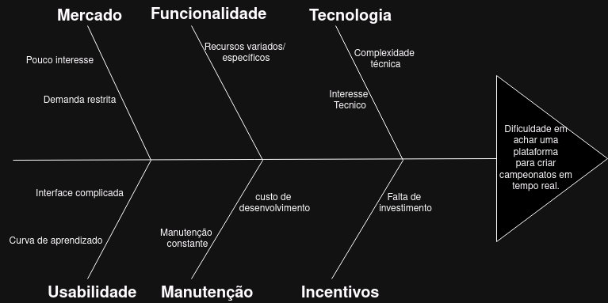

# Método Diagrama Causa-efeito (ishikawa)

## Introdução
xxxxxxxxxxxxxxxxxxxxxxxxxxxxxxxx

## Dificuldade em achar uma plataforma para criar campeonatos em tempo real:

## Mercado:

&emsp;&emsp;Refere-se à demanda e interesse do público ou dos consumidores pela plataforma. Um mercado com pouco interesse ou demanda restrita pode dificultar a viabilidade econômica do desenvolvimento da plataforma.

**Pouco interesse**: Existe uma falta de interesse geral no mercado para plataformas que criam campeonatos em tempo real, o que reduz a demanda e o investimento nesse tipo de tecnologia.

**Demanda restrita**: A procura por essas plataformas é limitada, talvez por serem nichos específicos ou pela falta de conscientização sobre os benefícios dessas soluções.

## Funcionalidade:

&emsp;&emsp;Envolve os recursos e capacidades específicas que a plataforma oferece. Para ser eficaz, a plataforma deve incluir uma variedade de funcionalidades que atendam às necessidades dos usuários, como a capacidade de criar e gerenciar campeonatos em tempo real.

**Recursos variados/específicos**: A plataforma precisa oferecer uma variedade de recursos e funcionalidades específicas para atender às diversas necessidades dos usuários.

## Tecnologia:

&emsp;&emsp;Refere-se aos aspectos técnicos envolvidos na criação e manutenção da plataforma. Isso inclui a complexidade técnica do desenvolvimento, bem como o nível de interesse e expertise técnica disponível para lidar com esses desafios.
 

**Complexidade técnica**: O desenvolvimento de uma plataforma para criar campeonatos em tempo real envolve desafios técnicos significativos, que podem dificultar a implementação e manutenção.

**Interesse técnico**: Pode haver uma falta de interesse ou conhecimento técnico entre os desenvolvedores para criar e manter essas plataformas, exacerbando os desafios tecnológicos.

## Usabilidade:

&emsp;&emsp;Diz respeito à facilidade de uso da plataforma. Uma interface intuitiva e uma curva de aprendizado suave são essenciais para garantir que os usuários possam utilizar a plataforma de maneira eficaz e sem frustrações.

**Interface complicada**: Se a interface da plataforma for difícil de usar, isso pode desmotivar os usuários e reduzir a adoção da plataforma.
  
**Curva de aprendizado**: Uma curva de aprendizado íngreme pode impedir que novos usuários se sintam confortáveis utilizando a plataforma rapidamente, afetando a experiência do usuário.

## Manutenção:

&emsp;&emsp;Refere-se às necessidades contínuas de manutenção e atualização da plataforma. Isso inclui a correção de bugs, a implementação de melhorias e a garantia de que a plataforma permaneça segura e funcional ao longo do tempo. O custo e o esforço necessários para a manutenção podem ser significativos.

**Manutenção constante**: A plataforma pode requerer manutenção contínua para permanecer funcional e segura, o que pode ser um desafio para os desenvolvedores.

**Custo de desenvolvimento**: O custo associado ao desenvolvimento e manutenção de uma plataforma robusta pode ser alto, tornando difícil para as empresas justificarem o investimento.

## Incentivos:

&emsp;&emsp;Envolve os fatores financeiros e motivacionais que incentivam o desenvolvimento e a utilização da plataforma. A falta de investimentos ou incentivos pode dificultar a criação e a sustentabilidade da plataforma, limitando seu crescimento e evolução.

**Falta de investimento**: A ausência de incentivos financeiros ou investimentos pode dificultar a criação e o crescimento de plataformas para campeonatos em tempo real.

 <figcaption>Figura 1: Diagrama Causa-efeito Dificuldades.</figcaption> 

|Versão|Data|Descrição|Autor|Revisor|
|:----:|----|---------|-----|:-------:|
| `1.1` | 02/11/2024 | Criação do documento/Inserção do primeiro diagrama | [Oscar de Brito](https://github.com/OscarDeBrito) | [Gustavo França](https://github.com/gustavofbs) |