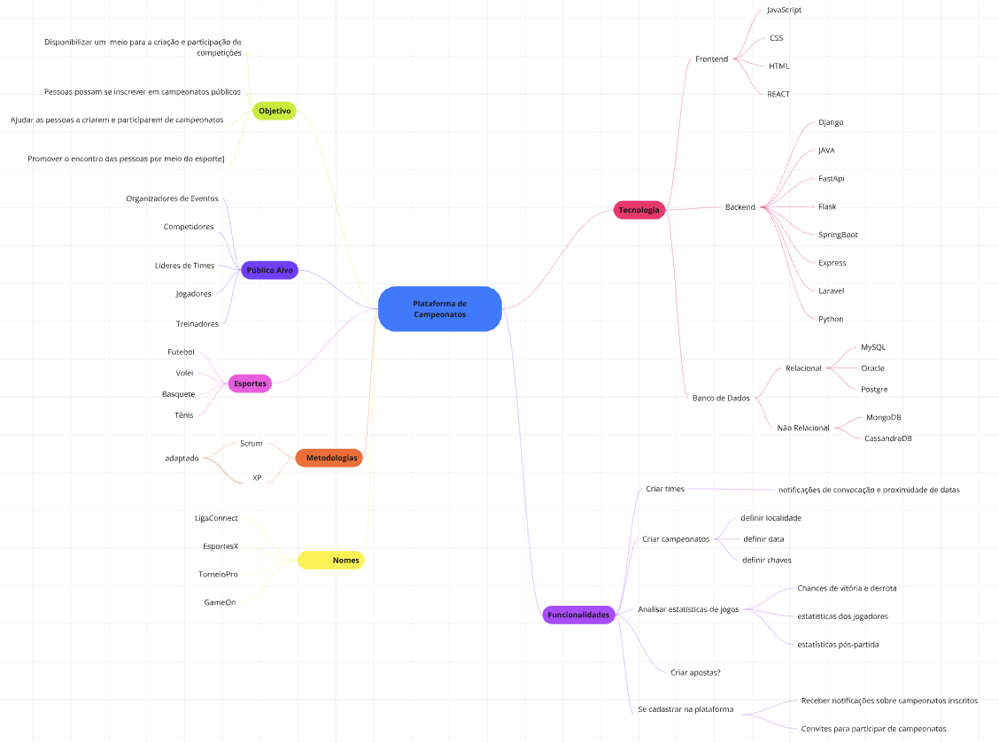

# Mapa Mental

## Introdução
xxxxxxxxxxxxxxxxxxxxxxxxxxxxxxxx

## Estrutura e Explicação do Mapa Mental: 
O mapa mental é uma técnica de organização que começa de uma ideia inicial e se ramifica para diferentes direções. Difundida por Tony Buzan sua aplicações são diversas como comunicação, estudo , revisões e planejamentos.

De forma mais específica , a construção do mapa mental é iniciada com um tema principal que é colocado ao centro de um espaço em branco , linhas saem desse tema simbolizando ramificações que se ligam com subtópicos tendo cada um uma cor que os diferencia, esses subtópicos de preferência são imagens ou palavra-chaves que tabem se ramificam para aprofundar o conteúdo. 

## Mapa mental elaborado
O Mapa mental apresentado a seguir foi baseado no brainstorm anteriormente elaborado para ajudar a organizar as sugestões da modelagem do projeto em questão.

 Autores: <a href="https://unbarqdsw2024-2.github.io/2024.2_G4_Esporte_Entrega_01/#/" target="_blank">Todos os integrantes</a> , 2024

## Referências Bibliográgicas 
- Iorio, Filipe. O Poder dos Mapas Mentais. MapaMental.org, disponível em: <https://www.mapamental.org/ebook-mapas-mentais/>. Acesso em: 2 nov. 2024.

- Como Criar Mapas Mentais. Estudo Esquematizado, disponível em: <https://estudoesquematizado.com.br>. Acesso em: 2 nov. 2024.

- Buzan, T. Dominando a Técnica dos Mapas Mentais. 

## Histórico de Versão

|Versão|Data|Descrição|Autor|Revisor| Detalhes da revisão |
|:----:|----|---------|-----|:-------:|-----| 
| 1.1 | 02/11/2024 | Criação do documento do mapa mental | [Christian Hirsch](https://github.com/) |  ||

